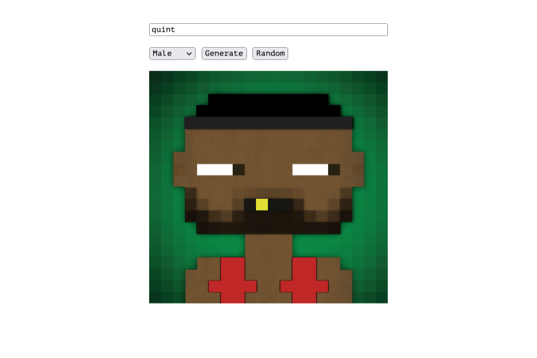

# Golang on the Internet Computer

Running Golang on the Internat Computer?! Yes, it is possible!  
This repository contains a simple example that shows how you can do it.

I used the [GOvatar](https://pkg.go.dev/github.com/o1egl/govatar@v0.4.1#section-readme) package (written in Golang) to generate avatars.  
All served from the Internet Computer. All written in Golang.

## Prerequisites

- DFX
- Golang

## Usage

1. Start a local replica (if you want to run it locally).
2. Build the Go WASM module (you can just run `build.sh` for this).
3. `dfx deploy`.
